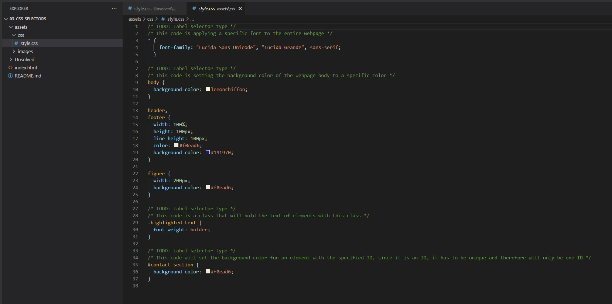

# 📐 Add Comments to Implementation of CSS Selectors

## 03 - CSS Selectors Virtual Class #2

Work with a partner to add comments that describe the functionality of the code found in [Unsolved](./Unsolved/assets/css/style.css).

## 📝 Notes

Refer to the documentation: 

[MDN Web Docs on HTML elements](https://developer.mozilla.org/en-US/docs/Web/HTML/Element)

[MDN Web Docs on attributes](https://developer.mozilla.org/en-US/docs/Glossary/Attribute)

[MDN Web Docs on CSS selectors](https://developer.mozilla.org/en-US/docs/Web/CSS/CSS_Selectors)

---

## Screenshots

The screenshot below shows the comments added to the css file.

Nothing to publish for this exercise.

---

## 🏆 Bonus

If you have completed this activity, work through the following challenge with your partner to further your knowledge:

* What are pseudo-class selectors? 

Use [Google](https://www.google.com) or another search engine to research this.

---
© 2022 Trilogy Education Services, LLC, a 2U, Inc. brand. Confidential and Proprietary. All Rights Reserved.
